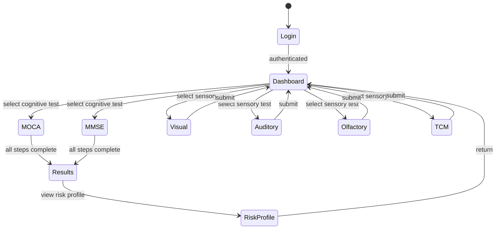
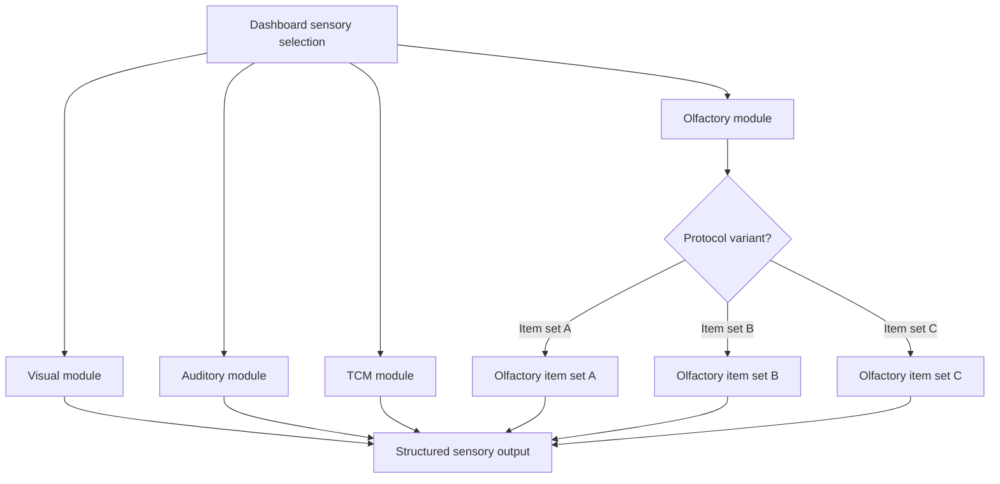
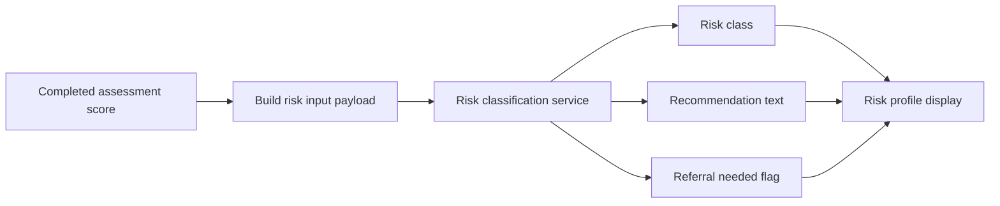
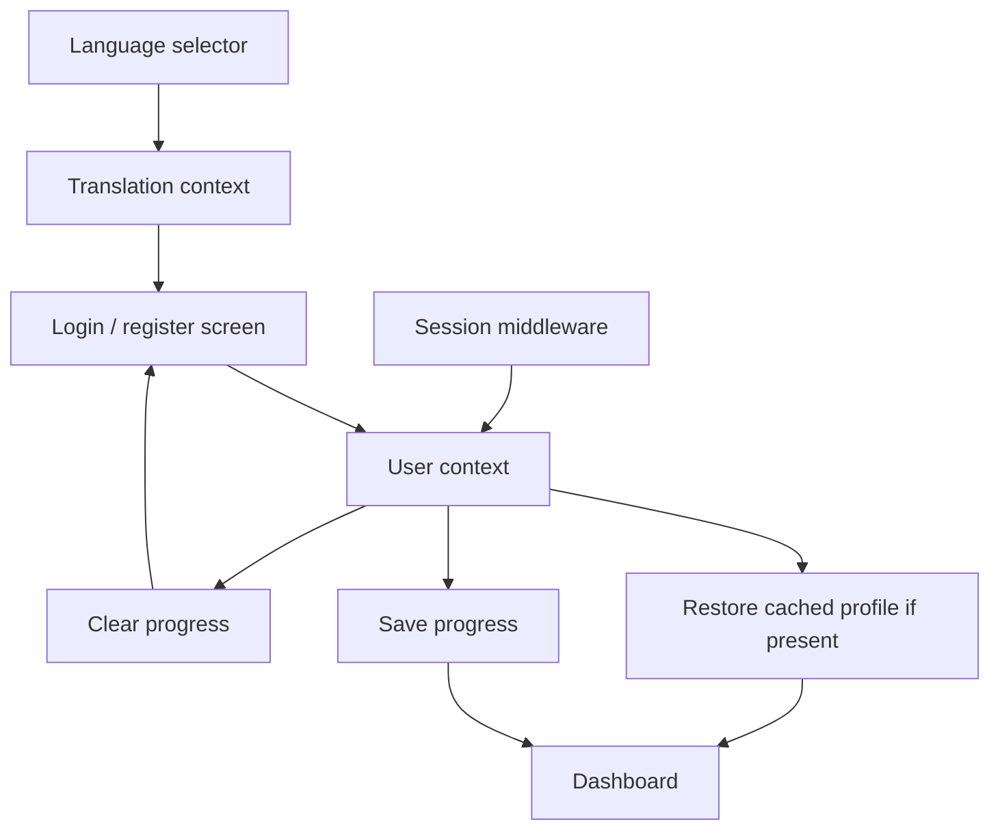
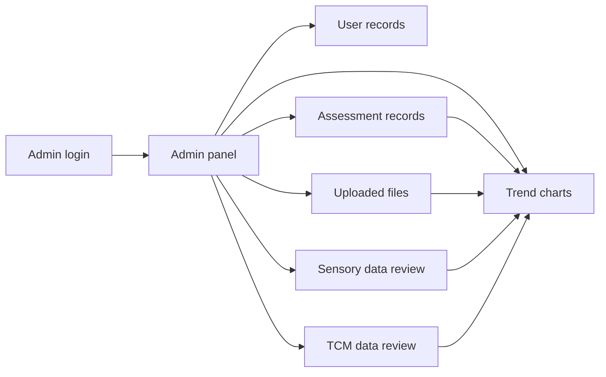
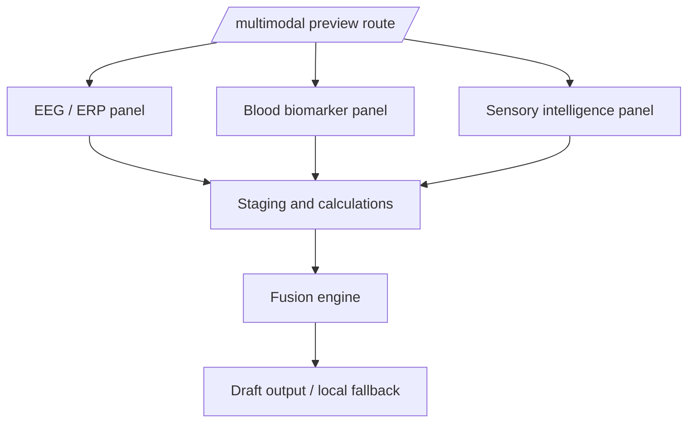

# Patent Figure Package

## FIG. 1: Overall system architecture and deployment boundaries
```mermaid
flowchart LR
  subgraph Patient[Patient application]
    Login[Login / Register]
    Dashboard[Dashboard]
    Cognitive[Cognitive assessments\n(MOCA / MMSE)]
    Sensory[Sensory assessments\n(visual / auditory / olfactory / TCM)]
    Results[Results and risk profile]
  end

  subgraph Cloud[Cloud backend and database]
    Auth[Session / auth]
    DB[(Assessments and progress data)]
    Rules[Risk classification service]
  end

  subgraph Admin[Admin / clinician console]
    AdminPanel[Admin panel]
    Analytics[Trend views and review tools]
  end

  subgraph Optional[Optional multimodal extension]
    Multimodal[/multimodal preview surface/]
    EEG[EEG / ERP input]
    Biomarker[Biomarker input]
    Fusion[Multimodal fusion engine]
  end

  Login --> Dashboard
  Dashboard --> Cognitive
  Dashboard --> Sensory
  Cognitive --> Results
  Sensory --> Results
  Results --> Rules
  Rules --> DB
  DB --> AdminPanel
  AdminPanel --> Analytics
  Multimodal --> EEG
  Multimodal --> Biomarker
  EEG --> Fusion
  Biomarker --> Fusion
```

## FIG. 2: Patient-side application state machine and workflow


## FIG. 3: Cognitive assessment engine, score normalization, and persistence flow

```mermaid
flowchart LR
  Start[Select MOCA or MMSE] --> Steps[Load step array and section keys]
  Steps --> Input[Capture raw score per step]
  Input --> Clamp[Clamp section score to valid bounds]
  Clamp --> Aggregate[Build section scores and total score]
  Aggregate --> Save[Save progress and assessment row]
  Save --> Classify[Run risk classification]
  Classify --> Update[Update saved assessment with risk data]
  Update --> Results[Show results screen]
```


## FIG. 4: Sensory module workflow, including olfactory protocol branching


## FIG. 5: Risk scoring and recommendation pipeline


## FIG. 6: Multilingual authentication and session persistence flow


## FIG. 7: Admin dashboard and analytics console workflow


## FIG. 8: Optional multimodal extension for EEG and biomarker inputs
